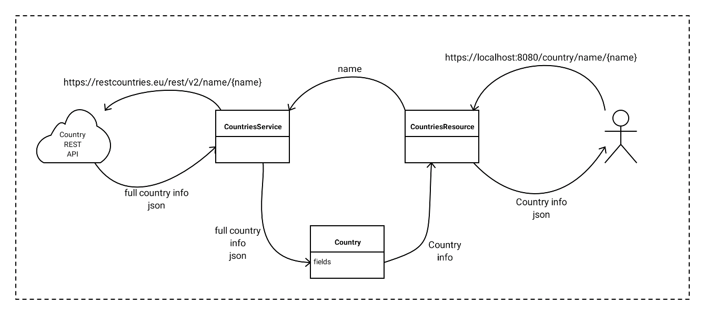
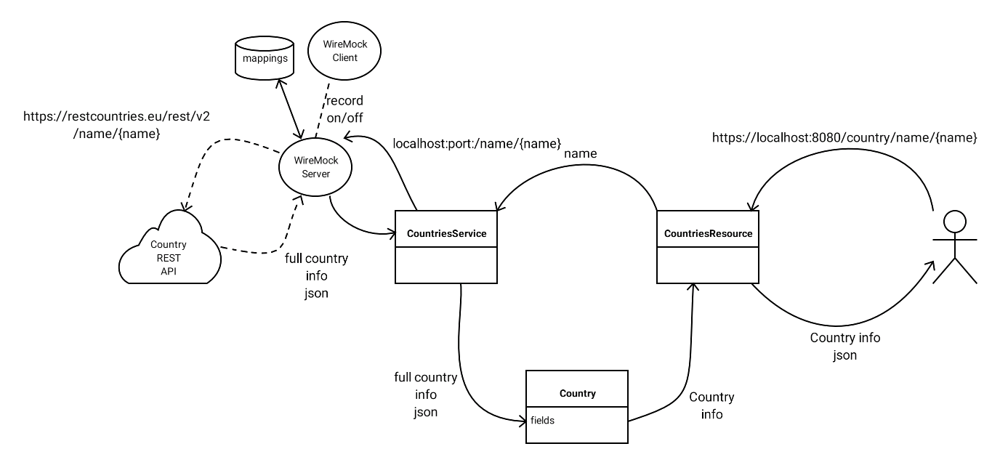

# WireMock automatic stub generation

This sample excercise project illustrates how the integrated version of WireMock can be used to automatically generate persistent stubs for testing purposes,
instead of manually creating these.
This project is using a Quarkus Rest Client that interrogates an external REST API.

## Overview of standard application

The user communicates with the REST API of the application *CountriesResource* using e.g. Postman or a web browser.
The REST Client of the application *CountriesService* communicates with an external REST API providing fact data of countries
(e.g. capital city, currency, etc.)

* Program can be run normally by selecting Maven goal quarkus:dev
* Unit testing of the REST Client can be performed by running the CountriesResourcesTest class

In order to accomodate testing without (always) being connected to te external REST API,
WireMock can be used to run tests offline after initial online automatic configuration.

## Overview of application testing with WireMock

WireMockServer is put in between of the applications' REST Client *CountriesService* and
the external REST API provider. WireMockServer initially operates as a proxy, forwarding the
*CountriesService* requests to the remote REST API and routing back the received results as well.
WireMock keeps a map in (volatile) memory of the send request and corrsponding received response;
when receiving a susequent identical request, the memorized response will be used.
In order make this mapping persistent in extenal files, the recording option is controlled 
by the WireMockCLient.

## WireMock implementation steps
Steps below illustrate how automatic stub recording can be implemented using WireMock

1. write your standard code including accompanying tests

2. redirect rest client to WireMockServer (localhost:<port>/baseUrl);
here this can be done in *applications.properties* file.
*baseUrl = /country*

3. before each @Test  
   a. start WireMockServer before/after each @Test using <port> definition as used under 1  
   b. check is stub mapping available for restUrl (here */name/{name}*) 
   c. if no mapping available: start WireMockClient recorder specifiying baseUrl of remote target API;
   WMserves now serves as a proxy for the rest client
   *baseUrl = https://restcountries.eu/rest/v2*  

3. after each @Test  
  a. check if recorder running  
  b. if recording then stop recording (this actually generates mapping files in *src/test/resources/mappings*)   
  Note: stopping a non-active recording session generates an error)  
  c. shudown WireMockClient (to prevent "port already occupied" in consecutive runs)  
  d. stop  WireMockServer

NOTE: WireMock either serves as a proxy (during recording) or as a stub using automatically generated mapping files (when NOT recording)

## ToDo
* try to seperate WireMock elements from the standard @Test definitions (not sure if this is possible due to
above point 3b) 
* there is room for further refactoring
* sort out alias rest-endpoint and use of *%test* prefix in *application.properties* ; current behaviour seems strange